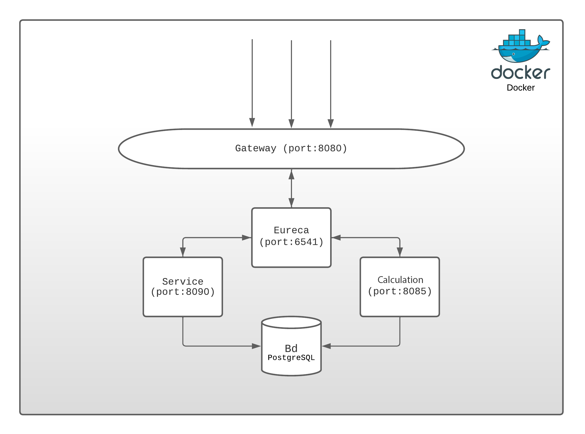
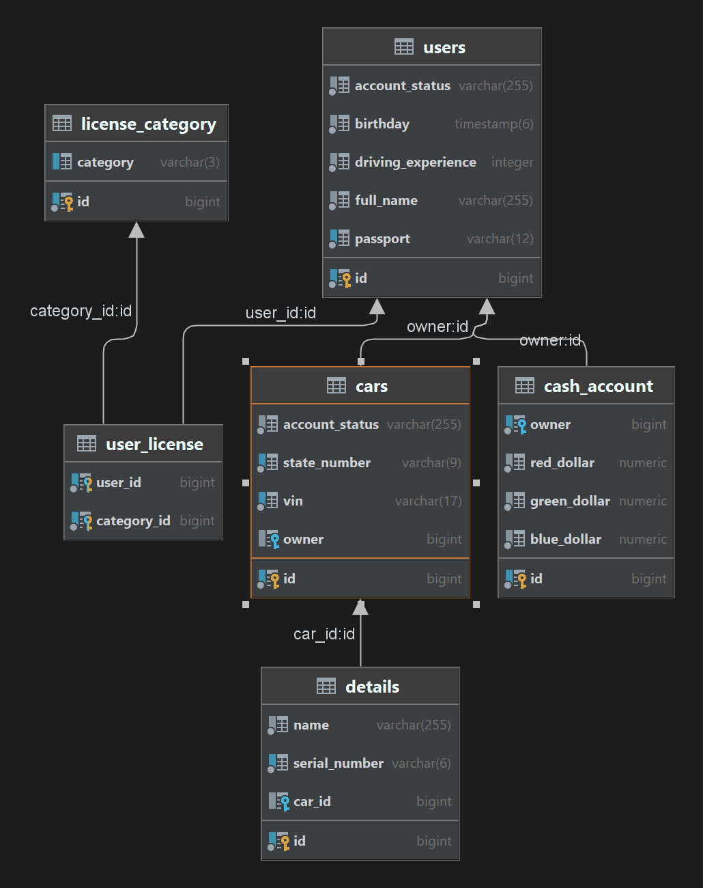

##  Тестовое задание для Rik Masters (Java-developer) / *rik-masters-test* #
**Выполненные задачи:**
1) Стек: Java 17, SQL, Spring Boot (MVC, AOP, Data, Eureka, Gateway), JUnit, Mockito, Docker, Hibernate, PostgreSQL, Swagger, Maven, Maven Checkstyle, Lombok, Mapstruct;
2) Выполнение всех пунктов высланного проверочного задания кроме комуникации сервисов (REST);
3) Реализована одна точка входа в приложение через gateway(port:8080) с перенаправлением запросов.
4) Написана часть тестов для сущности User. (JUnit, Mockito)
5) Для проверки и тестирования API написаны и приложены 18 Postman теста.
6) Написана документация в Swagger.

**Roadmap:**
1) Разделение БД сервисов. Написание прямой коммуникации между сервисами.  
2) Написание индивидуальных ошибок для возникающих в сервисах исключений.
3) Дополнение GlobalExceptionController на основе индивидульных ошибок и формирование определенных кодов ответов. 
4) Дополнение JUnit + Mockito тестирования с порытием классов и методов min 90%.
Перед началом работы необходитмо убедиться в том, что все сервисы поднялись и зарегистрировались в service discovery. Только после этого тесты Postman отработают верно.
#### [Ссылка на service discovery  (rik-eureka)](http://localhost:8761/)
Веб-сервис работы со счетами и поздравлением с днем рождения. (rik-calculation). Эта ссылка будет работать при запущенном приложении.
#### [Ссылка API swagger-ui документации и доступных эндпоинтов (rik-calculation)](http://localhost:8085/swagger-ui/index.html)
Веб-сервис для обработки потсупающей информации. (rik-service). Эта ссылка будет работать при запущенном приложении.
#### [Ссылка API swagger-ui документации и доступных эндпоинтов (vita-service)](http://localhost:8090/swagger-ui/index.html)

## Быстрый старт
### Требования
- Java Platform (JDK) 17
- Apache Maven 4.x
Находясь в каталоге в командной строке, введите:

`./mvn package`

`java -jar rikmasters-test/rik-eureka/target/rik-eureka-0.0.1-SNAPSHOT.jar`

`java -jar rikmasters-test/rik-gateway/target/rik-gateway-0.0.1-SNAPSHOT.jar`

`java -jar rikmasters-test/rik-service/target/rik-service-0.0.1-SNAPSHOT.jar`

`java -jar rikmasters-test/rik-calculation/target/rik-calculation-0.0.1-SNAPSHOT.jar`

## Быстрый старт Docker
### Требования

- Java Platform (JDK) 17
- Apache Maven 4.x
- Docker client (Docker-compose)
Находясь в каталоге в командной строке, введите:

`./mvn package`

`docker-compose up`
